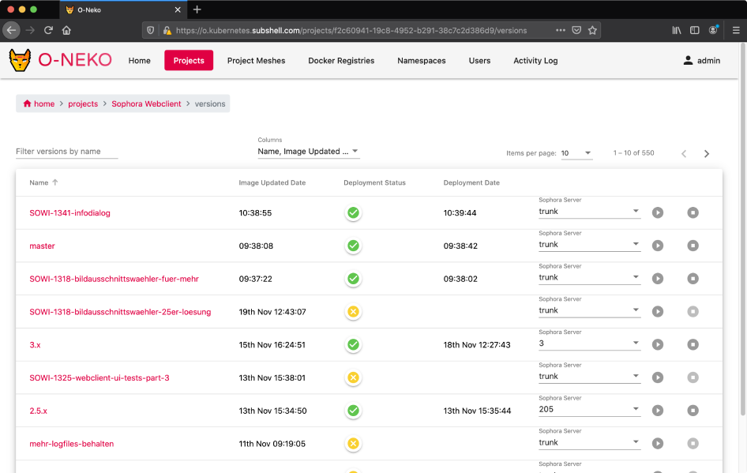

# O-Neko 

O-Neko is a Kubernetes-native application that allows to cross a bridge between developers and other stakeholders by deploying 
development versions of your software into Kubernetes to allow everybody to try and test them.

|       |       |       |
| ----- | ----- | ----- |
|  |  |  |

## Features

* Deploy development versions (e.g. every branch) to Kubernetes with one click
* Configure projects with native Kubernetes .yaml files
* Automatically re-deploy running versions when the corresponding Docker image has changed (configurable per project and version)
* Automatically stop running versions after a specific time (configurable per project and version)
* Project meshes that allow you to wrap multiple projects into one pool and deploy specific versions of them together,
effectively providing a way to deploy dynamic test server setups with ease
* Select variables that allow fast changes to frequently used configuration settings (e.g. server URLs)

## Pre-requisites

* Generally, nearly every project able to run in Kubernetes can be deployed with O-Neko
* You need Docker containers of all project versions you want to deploy with O-Neko
* You need to provide the Kubernetes .yaml files in a simple template format to configure a project
* O-Neko works with kubernetes versions 1.9.0 - 1.15.3

## How does it work?

* O-Neko is running inside your Kubernetes cluster
* A project consists of a Docker image that resides in any Docker registry. O-Neko is polling all tags that are available for this image and lets you deploy them.
* The configuration is done with native Kubernetes .yaml and template variables. O-Neko provides some variables (e.g. the docker image tag) but you can also define your own. The configuration and the variables can be overridden by specific versions.
* When a version of a project is deployed, O-Neko creates a namespace in Kubernetes to deploy all resources to. If you stop a deployment, the corresponding namespace will be deleted.
* The status of all running deployments is monitored by O-Neko and can be seen in the web frontend

## Contributing

If you want to report an issue or work on O-Neko please read our [contributing page](./CONTRIBUTING.md).

## Original authors

This project has been started in late 2017 as a "lab day" project by [@philmtd](https://github.com/philmtd), [@reinkem](https://github.com/reinkem), [@schwerlaut](https://github.com/schwerlaut), [@steffenkuche](https://github.com/steffenkuche) and [@tom-schoener](https://github.com/tom-schoener).
