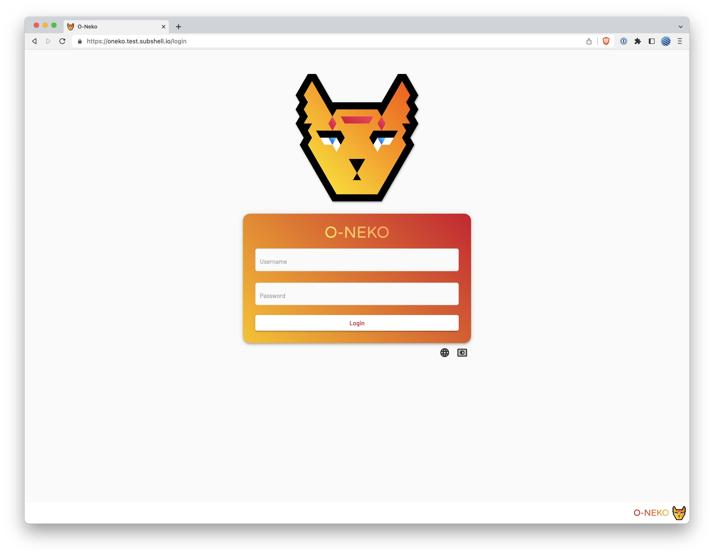

# O-Neko 

O-Neko lets everyone preview and try out new features of your software by creating on-demand test environments for feature branches. O-Neko is Kubernetes-native and allows for flexible project configurations via Helm charts. Make sure developers, testers, project managers, product owners and clients are on the same page! Preview and test _before_ you merge!

|       |       |       |
| ----- | ----- | ----- |
|  |  |  |

## Documentation and installation guide

[You can find our documentation here.](./docs/DOCUMENTATION.md)

## Features

* Deploy development versions (e.g. every branch) to Kubernetes with one click
* Configure projects via Helm charts
* Automatically re-deploy running versions when the corresponding Docker image has changed (configurable per project and version)
* Automatically stop running versions after a specific time (configurable per project and version)
* Select variables that allow fast changes to frequently used configuration settings (e.g. server URLs)

## Pre-requisites

* Generally, nearly every project able to run in Kubernetes can be deployed with O-Neko
* You need Docker containers of all project versions you want to deploy with O-Neko
* You need Helm charts for each project you want to deploy. The charts need to be hosted in a chart registry.
  * Currently we support standard Helm chart registries and Helm GCS
  * The Docker image tag and the image pull policy need to be configurable
* O-Neko works with kubernetes versions 1.10.0 - 1.23.3 (these versions are *officially* supported by the Kubernetes client library we use)

## How does it work?

* O-Neko is running inside your Kubernetes cluster
* A project consists of a Docker image that resides in any Docker registry. O-Neko is polling all tags that are available for this image and lets you deploy them.
* The configuration is done via Helm charts (values.yaml) and template variables. O-Neko provides some variables (e.g. the docker image tag) but you can also define your own. The configuration and the variables can be overridden by specific versions.
* The Helm release status of all deployments is monitored by O-Neko and can be seen in the web frontend

## Contributing

If you want to report an issue or work on O-Neko please read our [contributing page](./CONTRIBUTING.md).

## Original authors

This project has been started in late 2017 as a "lab day" project by [@philmtd](https://github.com/philmtd), [@reinkem](https://github.com/reinkem), [@schwerlaut](https://github.com/schwerlaut), [@steffenkuche](https://github.com/steffenkuche) and [@tom-schoener](https://github.com/tom-schoener).

* * *

Take a look at this project from the [subshell](https://subshell.com) team. We make [Sophora](https://subshell.com/sophora/): a content management software for content creation, curation, and distribution. [Join our team!](https://subshell.com/jobs/) | [Imprint](https://subshell.com/about/imprint/)

